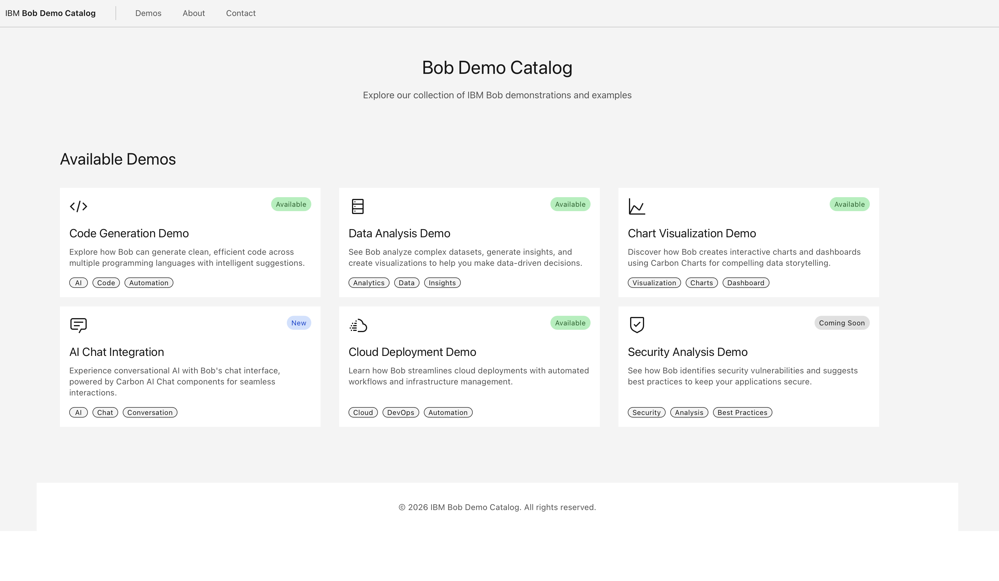

# Bob Demo Catalog

A modern demo catalog application built with React and IBM Carbon Design System, showcasing various IBM Bob demonstrations and capabilities.



## 🚀 Features

- **Carbon Design System**: Built with Carbon React v11 components
- **Responsive Design**: Optimized for mobile, tablet, and desktop
- **Modern Stack**: React 18 + Vite for fast development
- **Demo Showcase**: 6 interactive demo cards featuring:
  - Code Generation
  - Data Analysis
  - Chart Visualization
  - AI Chat Integration
  - Cloud Deployment
  - Security Analysis

## 🛠️ Tech Stack

- **React** 18.3.1
- **Vite** 6.0.3
- **Carbon Design System** (@carbon/react v1.68.0)
- **Carbon Icons** (@carbon/icons-react v11.49.0)
- **SCSS** with Carbon tokens

## 📦 Installation

```bash
# Install dependencies
npm install

# Start development server
npm run dev

# Build for production
npm run build

# Preview production build
npm run preview
```

## 🎨 Design System

This project follows IBM Carbon Design System guidelines:
- Uses Carbon tokens for spacing, colors, and typography
- Implements responsive grid system
- Follows accessibility best practices
- Maintains consistent component usage

## 📁 Project Structure

```
├── index.html
├── package.json
├── vite.config.js
└── src/
    ├── main.jsx
    ├── index.scss
    ├── App.jsx
    ├── App.scss
    └── components/
        ├── DemoCatalog.jsx
        └── DemoCatalog.scss
```

## 🌐 Development

The application runs on `http://localhost:5173/` by default.

## 📄 License

MIT

## 🤝 Contributing

Contributions, issues, and feature requests are welcome!

---

Made with ❤️ using IBM Carbon Design System